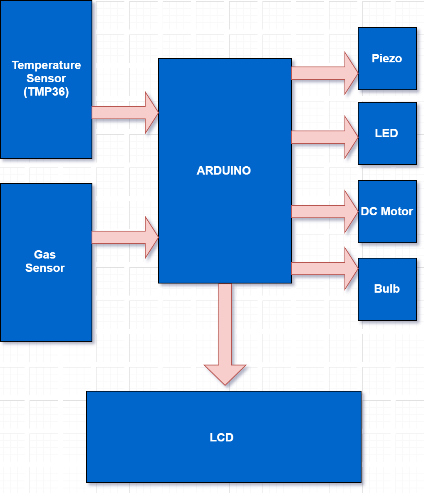
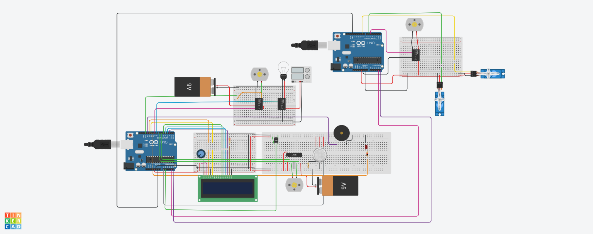
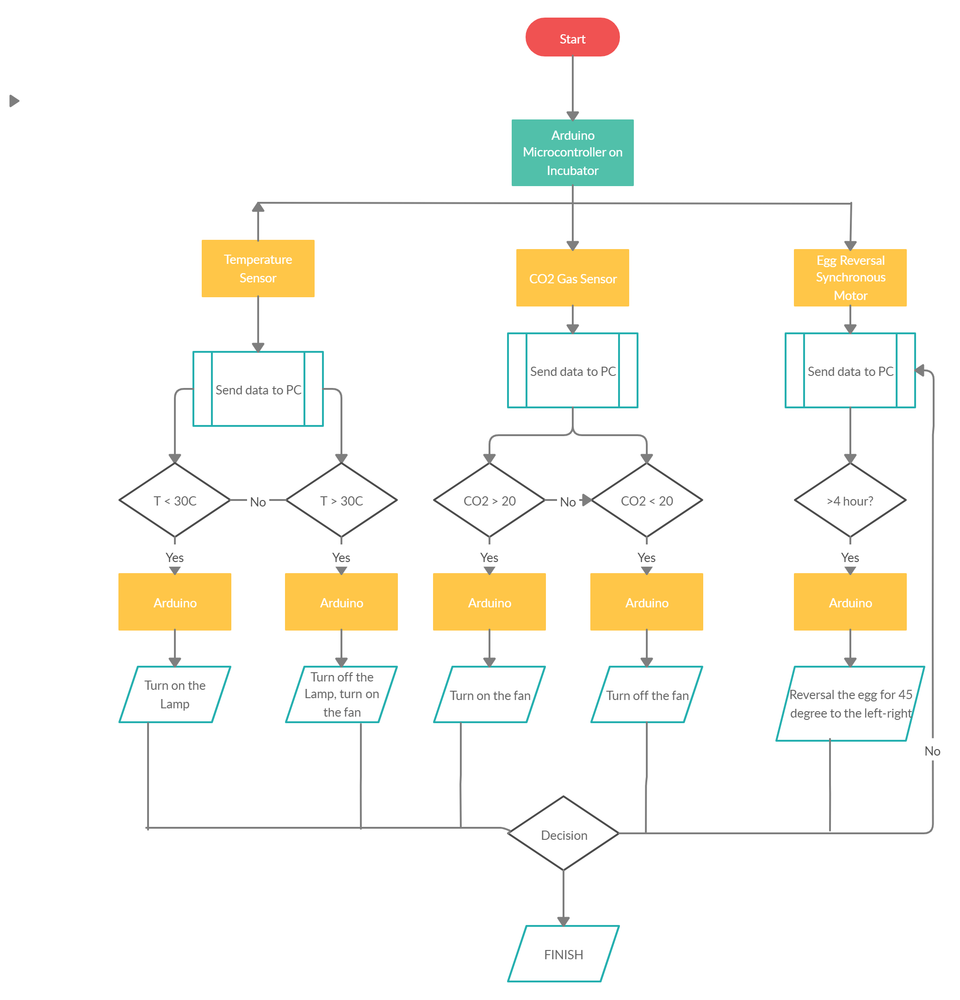

With our Smart Hatchery System Project, you can have a small chicken farm, even for small tradesmen, farmers or individually. The high price of incubators is a project that has been considered because it creates a great obstacle for low budget entrepreneurs. The aim is not to produce a large number of living creatures, but to provide optimum efficiency with healthier and limited production. Not only price but also time saving was saved to the user. The working system is no different from very high cost machines. It will control the heat and humidity sensors by working continuously, to keep the fresh air inside the balance for the fans. The gas sensor will keep the air control under control.

# How It Works

 - We used 2 Arduino. The first reason is that there is no space left in the first arduino and the modules started working slowly. The second reason is to prevent poisoning of the eggs as a result of power cuts.
 - It will continue to work even in case of power cuts.
 - Temperature and gas sensors work. If the temperature and gas (C2O) level is high, the fans will start and piezo starts to ring.
 - The bulb is a heater. It heats ambient up to 30 degrees.
 - The LCD display will constantly show gas and temperature values. In this way, it will be easier to follow.
 - The second Arduino circulation system will work continuously.
 - We used two servo motors. The first will ensure that the container in which the eggs are placed will be turned and the posture angle of the eggs needs to change with an angle of 45 degrees, every four hours, ensuring that the egg is exposed to equal heat all over the egg.
 - Other servo motor is used for power cuts. It will be used for entering. If no data is received from the first circuit, the servo motor will start and a section such as door or window will be opened and the temperature, humidity, gas level inside.

## Setting it up
**Parts**

-2 Arduino Uno 
-LCD 16x2 
-Potansiyometer 
-2 Rezistor 
-3 DC motor 
-H bridge 
-Gas Sensor 
-Temprature Sensor 
-The Bulb 
-3 Relay 
-2 Servo 
-2 9V Battery 
-Piezo 
-Power Supply 
-Led 
-Buzzer 

## Circuit Schematic

## Blok Diagram

## **Operation Flow**

